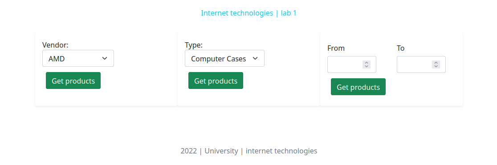
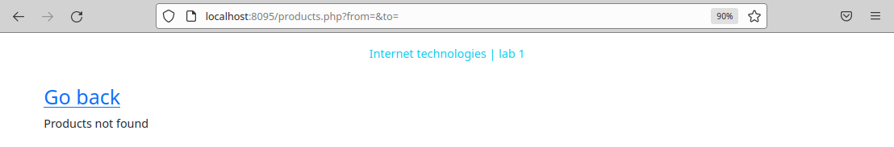
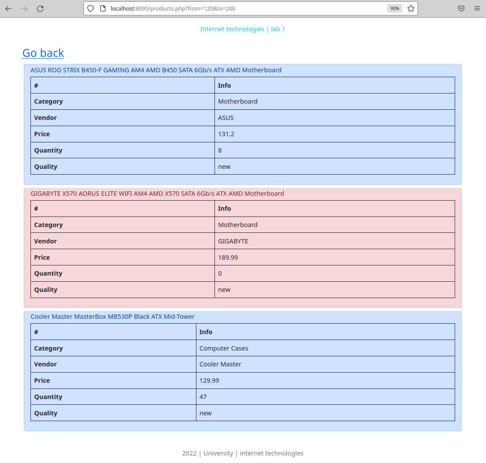
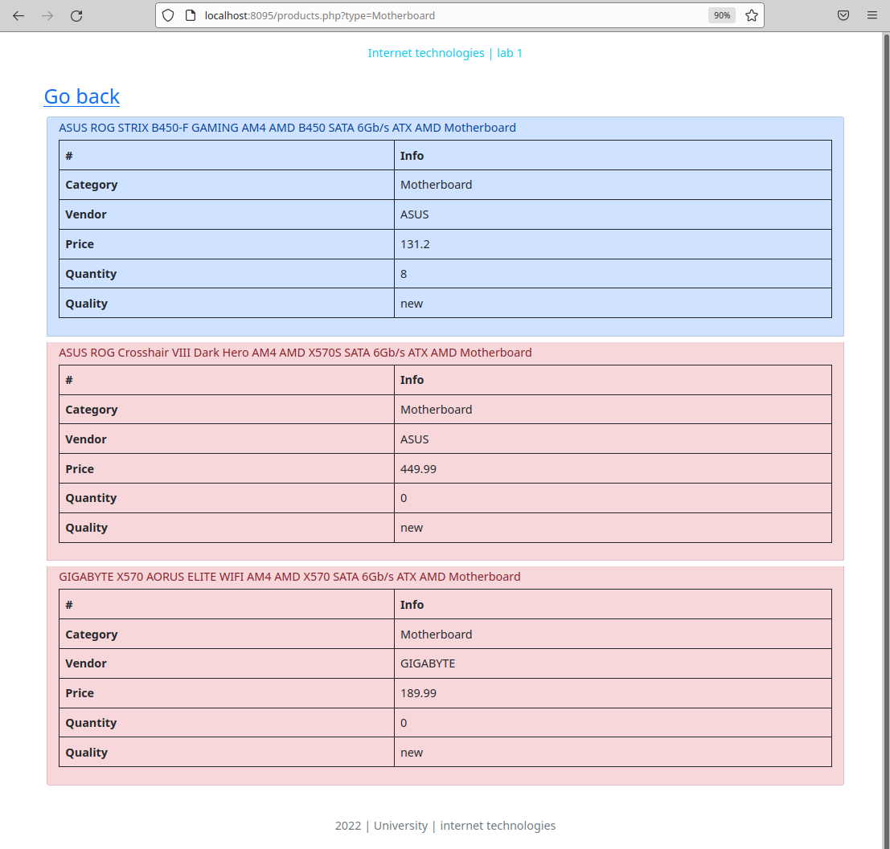
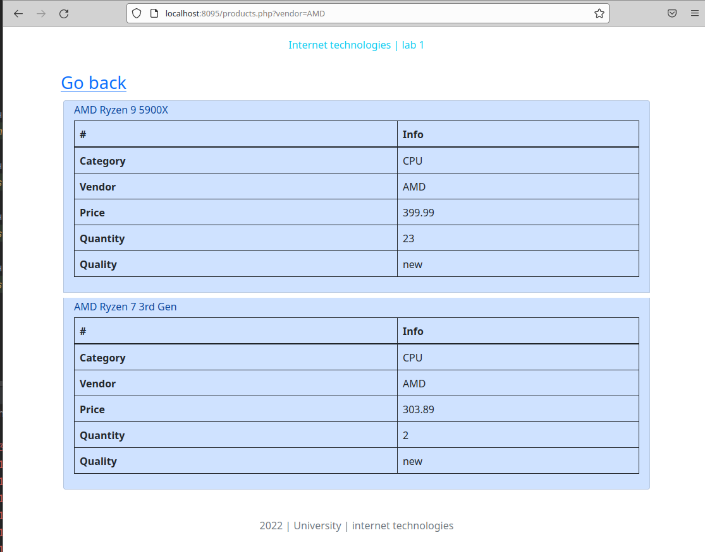

## Лабораторная работа №1

---

Создать и заполнить произвольными данными БД для хранения информации о товарах в интернет–магазине.

Для товара задается название, фирма-производитель, категория товара (процессоры, материнские платы и т.д.), цена товара, количество единиц на складе.

Сформировать запросы и вывести результаты:

    товары выбранного производителя;
    товары выбранной категории;
    товары в выбранном ценовом диапазоне.

---

### Результаты

Стартовая страница

Продукты не найдены

Товары в выбранном ценовом диапазоне.

Товары c выбранным критерием.

Товары c выбранным производителем.
